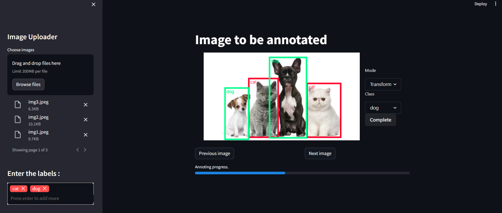

# Efficiently annotate images with your custom labels using this Streamlit application.



## Features:

- Intuitive interface: Navigate effortlessly with a user-friendly design.
- Image uploads: Upload multiple images for batch annotation.
- Customizable labels: Define the specific labels that suit your needs.
- Interactive bounding box creation: Precisely define regions of interest within images.
- Label assignment: Assign appropriate labels to each bounding box.
- Progress tracking: Stay informed of your progress with a clear progress bar.
- Annotated image and label storage: Labeled images and corresponding bounding box information are automatically saved for further processing or analysis.

## Installation:

1. Clone the repository:
```Bash
git clone https://github.com/MatheussAlvess/annoting-app.git
```

2. Install dependencies:
``` Bash
cd image-annotation-app
pip install -r requirements.txt
```

## Usage:

1. Run the app:

```Bash
streamlit run app.py
```

2. Access the app in your web browser.
3. Upload images: Use the sidebar to select and upload your images.
4. Define labels: Provide a comma-separated list of labels in the sidebar.

5. Annotate images:
  - Click on an image to activate the annotation interface.
- Click and drag to create bounding boxes around regions of interest.
- Assign labels to each bounding box from the provided list.

6. Navigate images:
 - Use the "Previous image" and "Next image" buttons to move between images.

7. View progress: Track your annotation progress with the progress bar.

## Annotated Data Storage:

- Labeled images are saved within the "images_annoted" folder.
- Corresponding bounding box information and labels are stored in text files within the "labels_annoted" folder, with filenames matching the original image names (excluding extension).

## Additional Information:

- Built with: Streamlit, Pillow, streamlit-tags, streamlit-image-annotation

## Explore the app and streamline your image annotation process!
